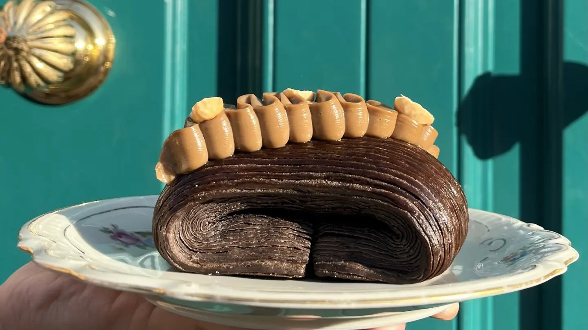
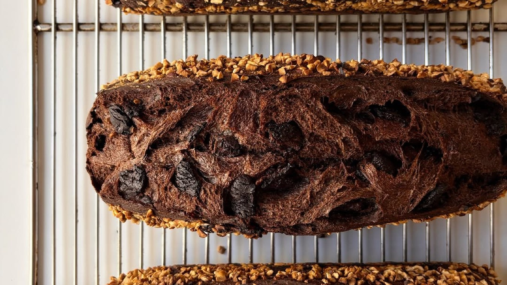
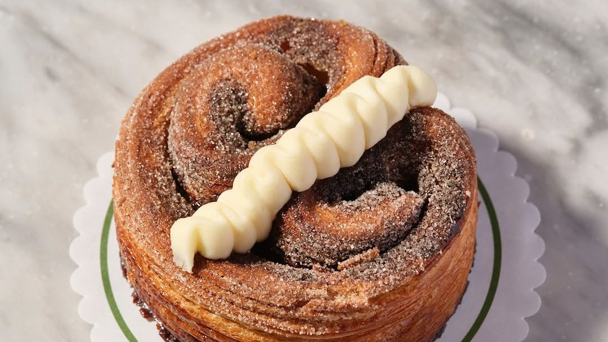
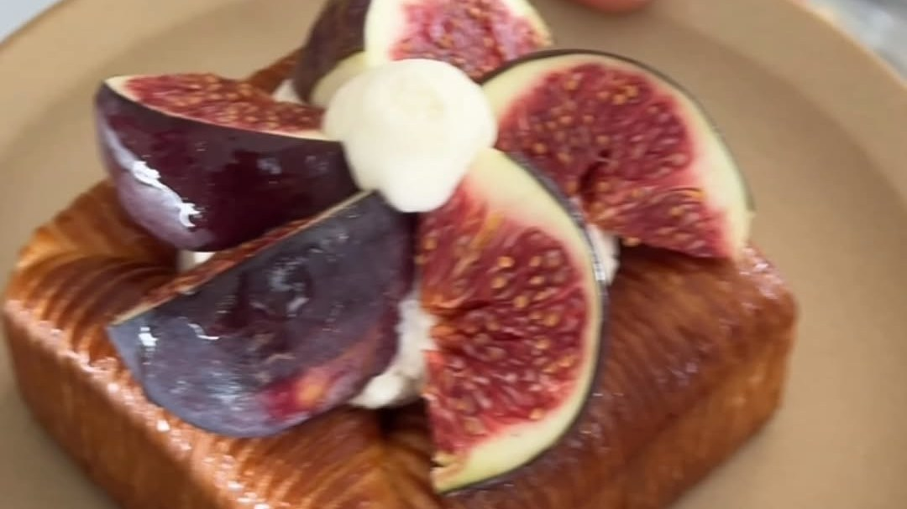
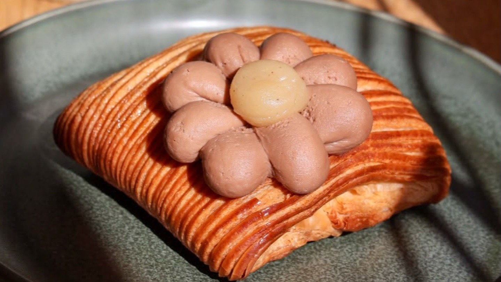
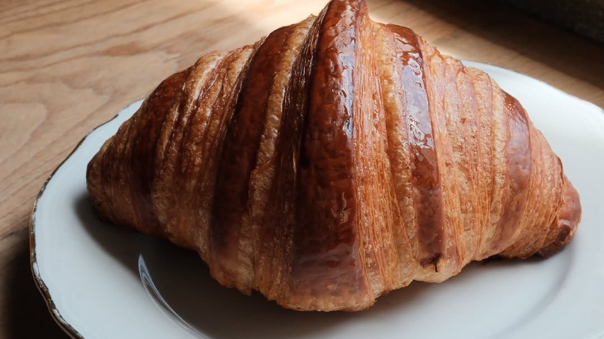
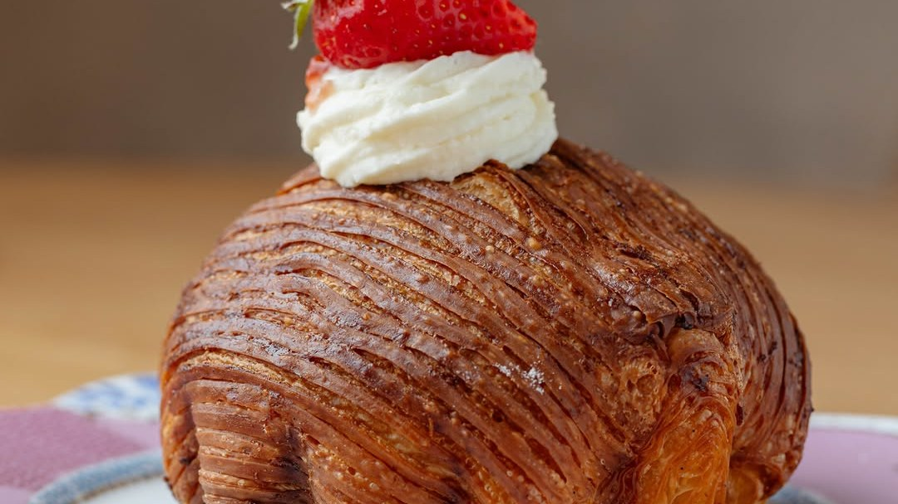
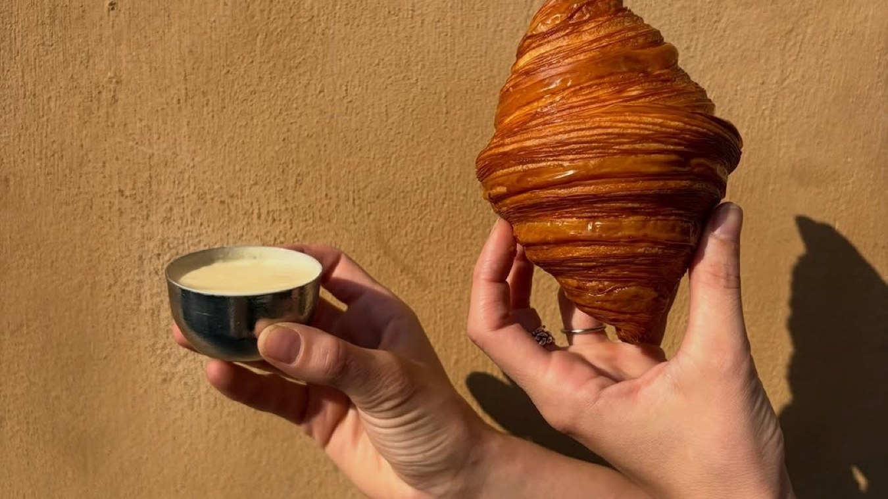

The Roman breakfast is a ninety-second affair: a cappuccino and a cornetto at the counter, a coin on the saucer, gone. It is a fine ritual and nobody should talk you out of it.

But the city has grown a second kind of morning over the last few years. Bakeries that laminate their own dough, rooms that roast their own beans, places where you sit down, order a filter coffee and stay a while. They are not hidden and they are not cheap, but they are good, and they are spread far enough apart that one is near wherever you slept.

These are eight of them.

## Faro

*Photo: @farorome*

Faro opened in 2016 and calls itself the first specialty coffee shop in Rome. The beans are their own, roasted under the name Aliena, and the list runs to single origins you can have as espresso or through a V60.

The bakery is the other half of the reason to come: croissants, cruffins and the rest of the morning pastry, and an all-day brunch menu if you would rather sit for longer. It is a short walk from Porta Pia and the Termini side of the centre.

**Via Piave 55, 00187 Rome** · [Website](https://www.farorome.com/)

## Forno Conti & Co.

*Photo: @fornoconti.roma*

A neighbourhood bakery in the streets behind Piazza Vittorio, run by Sergio Conti, where the ovens work all day and the shelves change with them. In the morning it is cornetti and brioche; later bread, focaccia and pizza, with babka and carrot cake for whoever is still undecided.

There are a few tables, and the menu stretches to granola, eggs and toast if you want to make a meal of it.

**Via Giusti 18, 00185 Rome** · [Instagram](https://www.instagram.com/fornoconti.roma/)

## Cresci

*Photo: @cresciroma*

Half bakery, half bistro, a few minutes' walk from St Peter's. Cresci is built around what Romans call the *arte bianca*, the craft of flour and dough: brioche and croissants in the morning, pizza al taglio at lunch, pizza in the pan at night.

It opens at seven every day, which makes it the obvious stop before an early Vatican slot.

**Via Alcide de Gasperi 11/17, 00165 Rome** · [Website](https://www.cresciroma.it/)

## Slow

*Photo: @slow.roma_*

Slow has its own door on Corso Vittorio Emanuele, though it sits inside the Trame hotel, and it comes from the same people as Love, further down this list. The room is pale and spare, around thirty seats, and there is no counter to drink at: you sit, and that is rather the point.

Specialty coffee, filter included, and a pastry lab turning out croissants and viennoiserie, with brunch through the day.

**Corso Vittorio Emanuele II 73, 00186 Rome** · [Instagram](https://www.instagram.com/slow.roma_/)

## Love

*Photo: @love.roma_*

Love opened in 2023 in Prati, in the shop on Via Tunisi that was for decades the Salsamenteria Simonetti, and took its cues from French and Scandinavian bakeries. It is a croissant shop first, with specialty coffee to go with it.

The one people come for is the Moon Love, a coffee-scented croissant in a shape you will recognise from the name. The Vatican Museums are a short walk away.

**Via Tunisi 51, 00192 Rome** · [Instagram](https://www.instagram.com/love.roma_/)

## Marzapane

*Photo: @marzapaneroma*

Steps from Piazza del Popolo, on Via Flaminia, Marzapane runs as a café and bakery every morning from half past eight: brioche, pastries, pancakes and coffee in a room that feels more like a restaurant than a bar, which in the evenings it also is.

A good choice if breakfast is going to turn into a long one.

**Via Flaminia 64, 00196 Rome** · [Website](https://www.marzapaneroma.com/)

## Bap

*Photo: @bap__roma*

Bap opened in July 2024 on Via Cadorna, between Via Veneto and Porta Pia. Behind it is Giulia Mauceri, third generation of the Torrefazione 68 roasting family, so the coffee is theirs; the pastry comes from an in-house lab.

Breakfast is pastry and coffee from seven, lunch leans towards savoury dishes, and on Fridays and Saturdays it stays open for dinner.

**Via Raffaele Cadorna 5, 00187 Rome** · [Instagram](https://www.instagram.com/bap__roma/)

## Barnum

*Photo: @barnumroma*

Barnum spent seventeen years at number 87 of Via del Pellegrino before moving a few doors down to Palazzo dei Re Magi, named for the old fresco on its façade. The new rooms are larger and lighter, with oak tables and long shared ones.

Filter coffee, breakfast and baked goods in the morning, a two-minute walk from Campo de' Fiori.

**Via del Pellegrino 63/65, 00186 Rome** · [Instagram](https://www.instagram.com/barnumroma/)
