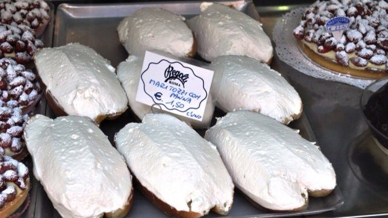
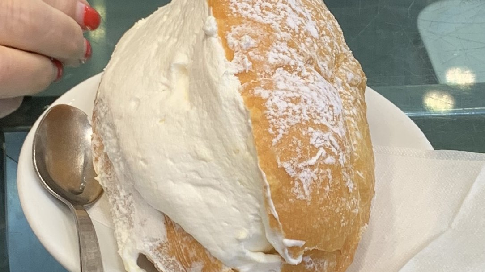
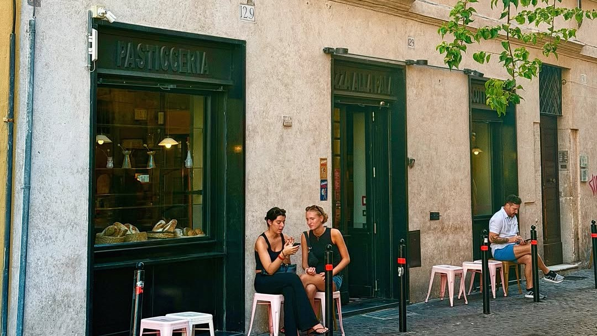
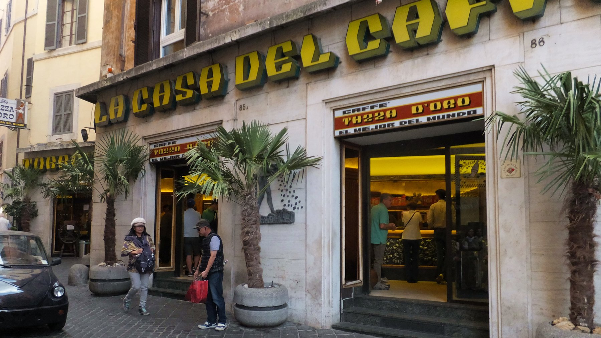
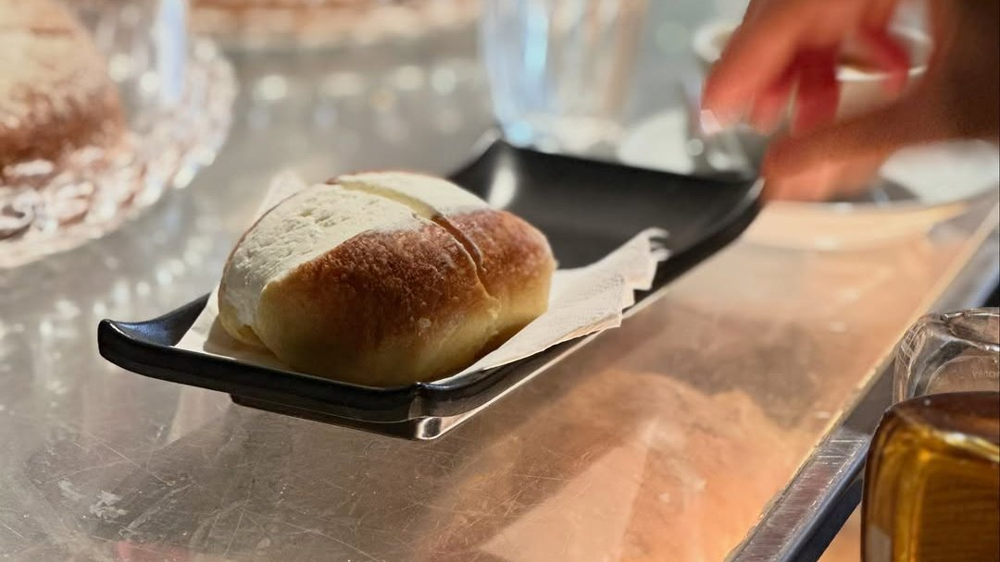
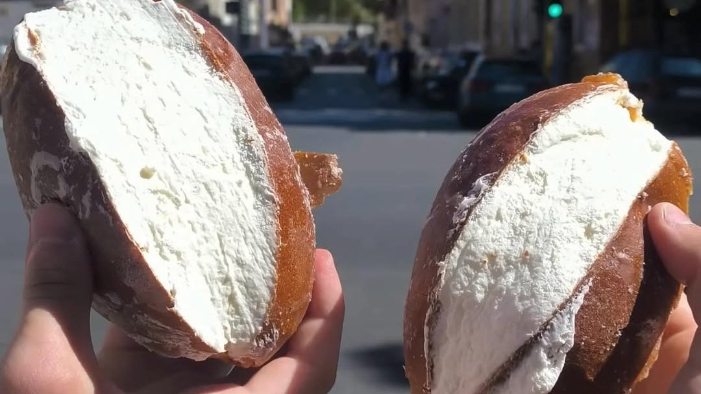
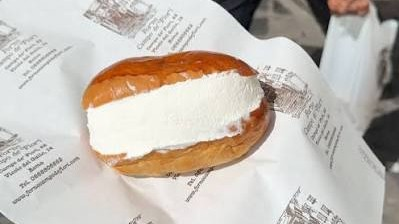
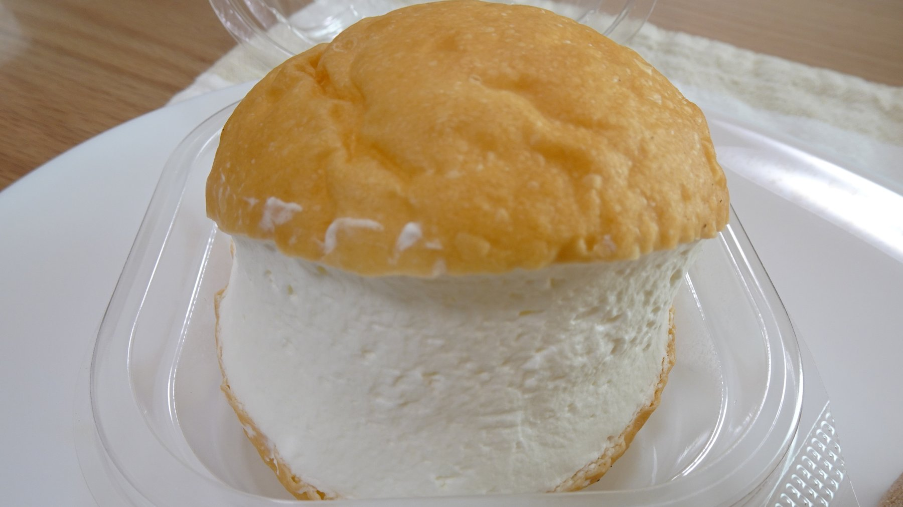

The maritozzo is a sweet bun, light and slightly glossy, split down the middle and filled with so much whipped cream that the bread becomes almost a frame. Romans eat it at breakfast with a cappuccino, mid-morning when the cornetto has worn off, and at three in the morning on the way home.

It is a simple thing, which is exactly why the difference between a good one and a tired one is obvious from the first bite: the dough should be soft and smell of yeast, the cream fresh and barely sweetened.

These are eight places that get it right.

## Pasticceria Regoli

Regoli has been on Via dello Statuto, near Piazza Vittorio, since 1916, and the sign over the window still says so. It is a proper old pasticceria, glass counters and all, and the maritozzo is the reason most people queue: a well-risen bun and cream whipped on the day.

**Via dello Statuto 60, 00185 Rome**

## Panificio Bonci

*Photo: [Gerjantd](https://commons.wikimedia.org/wiki/File:Freshly_baked_Roman_maritozzo.jpg), CC BY-SA 4.0, via Wikimedia Commons*

Gabriele Bonci made his name with Pizzarium, the pizza al taglio counter near the Vatican Museums. His bakery is a short walk away in Trionfale, and it reopened on 11 September 2026 at a new number on the same street: bread first, then pizza, sandwiches and a counter of baked sweets, the maritozzo among them.

Worth combining with Pizzarium if you are spending the morning at the Vatican. It opens at half past eight and, from Tuesday to Thursday, closes between three and five in the afternoon.

**Via Trionfale 34, 00195 Rome** · [Website](https://panificiobonci.it/)

## Forno Monteforte

*Photo: @fornomonteforte*

An old bakery on Via del Pellegrino, a couple of minutes from Campo de' Fiori, that has grown into a café without giving up the ovens. There are some twenty kinds of bread, pizza alla pala and a pastry counter made in-house, maritozzi included.

It stays open from breakfast into the evening, with wine and something to eat once the coffee hour is over.

**Via del Pellegrino 129, 00186 Rome** · [Website](https://fornomonteforte.com/)

## La Casa del Caffè Tazza d'Oro

*Photo: [lienyuan lee](https://commons.wikimedia.org/wiki/File:La_Casa_del_Caffe_Tazza_D%60oro_%E9%87%91%E6%9D%AF%E5%92%96%E5%95%A1%E9%A4%A8_-_panoramio.jpg), CC BY 3.0, via Wikimedia Commons*

Tazza d'Oro has been roasting coffee since 1944, and its shop sits a few steps from the Pantheon. It is a coffee bar in the old Roman way, a counter more than a café, and one of the last craft roasters still working in the historic centre.

Order an espresso of their own roast and something sweet to go with it. In summer, the granita di caffè with whipped cream is the other thing it is known for.

**Via degli Orfani 84, 00186 Rome** · [Website](https://www.tazzadorocoffeeshop.com/)

## Roscioli Caffè

*Photo: @rosciolicaffe*

The Roscioli family runs a bakery, a deli and a restaurant around the Campo; the café is theirs too, on Piazza Benedetto Cairoli. The pastry comes from their own lab, and the maritozzi sit at the front of the counter, round and overfilled.

It opens at seven, eight on Sundays, and closes at six in the evening.

**Piazza Benedetto Cairoli 16, 00186 Rome** · [Website](https://rosciolicaffe.com/)

## Il Maritozzaro

*Photo: @maritozzaro*

The name says it all: a bar built around the maritozzo, on Via Ettore Rolli between Trastevere station and Monteverde. No décor to speak of, no tables, just a counter, the buns, the cream and a lot of regulars.

It keeps very long hours, which is why it is as much a late-night stop as a breakfast one.

**Via Ettore Rolli 50, 00153 Rome** · [Instagram](https://www.instagram.com/maritozzaro/)

## Forno Campo de' Fiori

The bakery on the square itself, and one of the oldest names in the centre. Most people come for the pizza bianca and pizza rossa, cut to order and still warm, but the counter also carries bread, biscuits, ciambelline al vino and the traditional Roman sweets, maritozzo included, handed over in the bakery's own printed paper.

Closed on Sundays, and in summer on Saturday afternoons too.

**Piazza Campo de' Fiori 22, 00186 Rome** · [Website](http://www.fornocampodefiori.com/)

## Antico Forno Trevi

*Photo: [RuinDig](https://commons.wikimedia.org/wiki/File:Maritozzo---2021-08-30.jpg), CC BY 4.0, via Wikimedia Commons*

A few steps from the Trevi Fountain, Antico Forno Trevi has been baking since 1939, and the city of Rome lists it among its historic shops. Bread, pizza al taglio and sandwiches made to order, and a counter of Roman pastries for a sweet stop in the busiest corner of the centre.

**Via delle Muratte 8, 00187 Rome** · [Website](https://www.anticoforno.it/)
