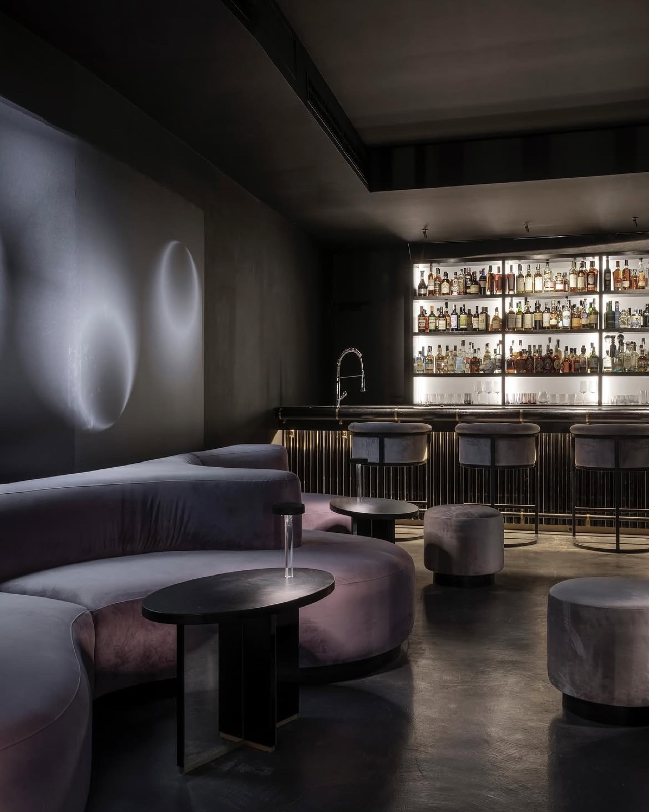
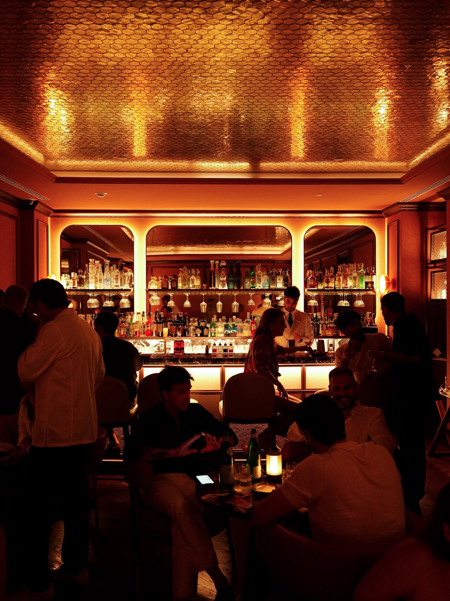
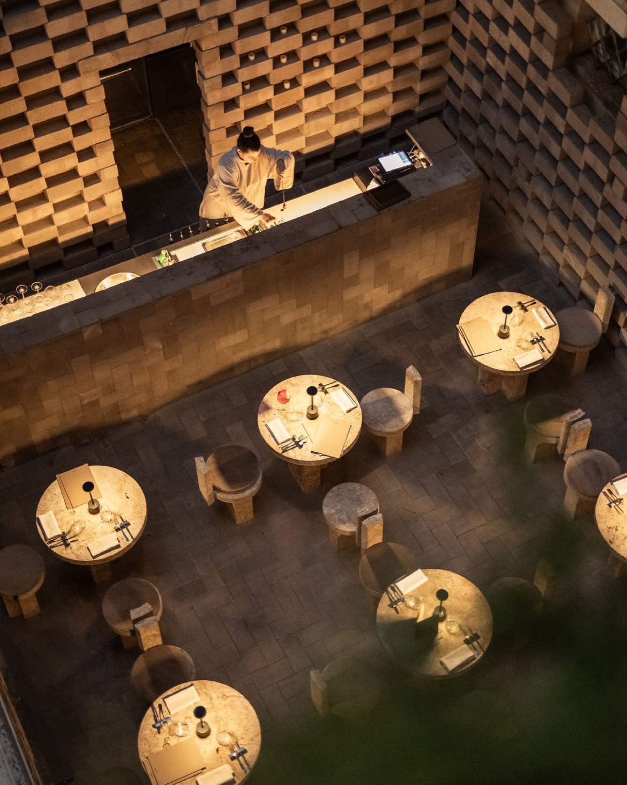
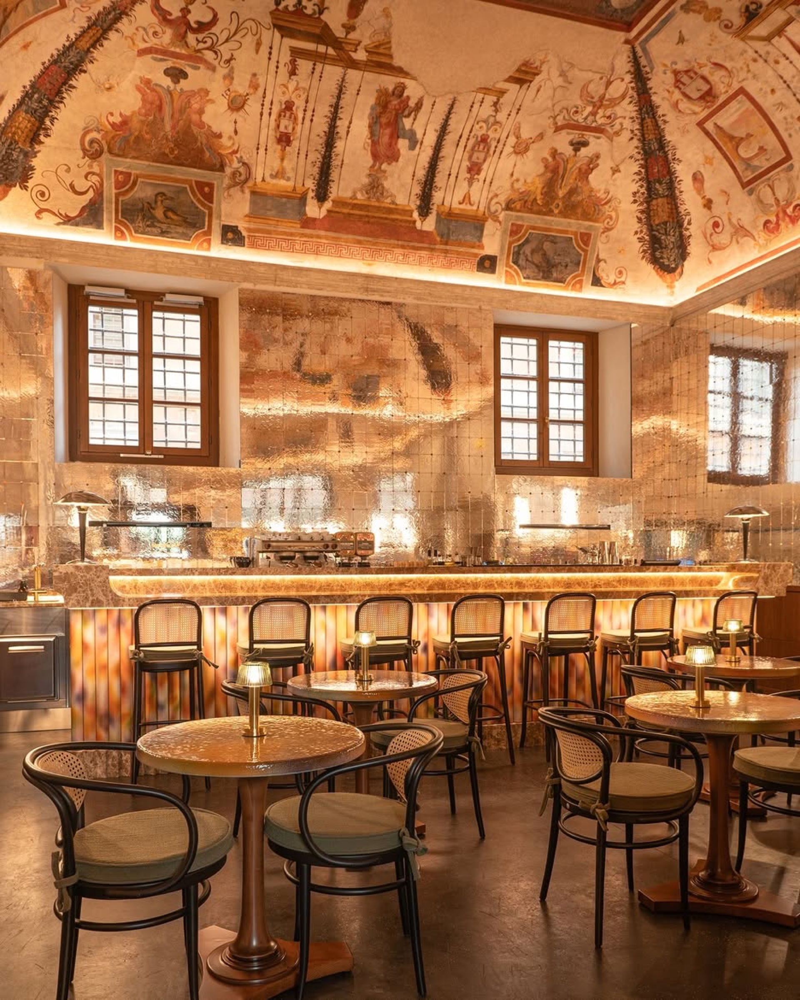
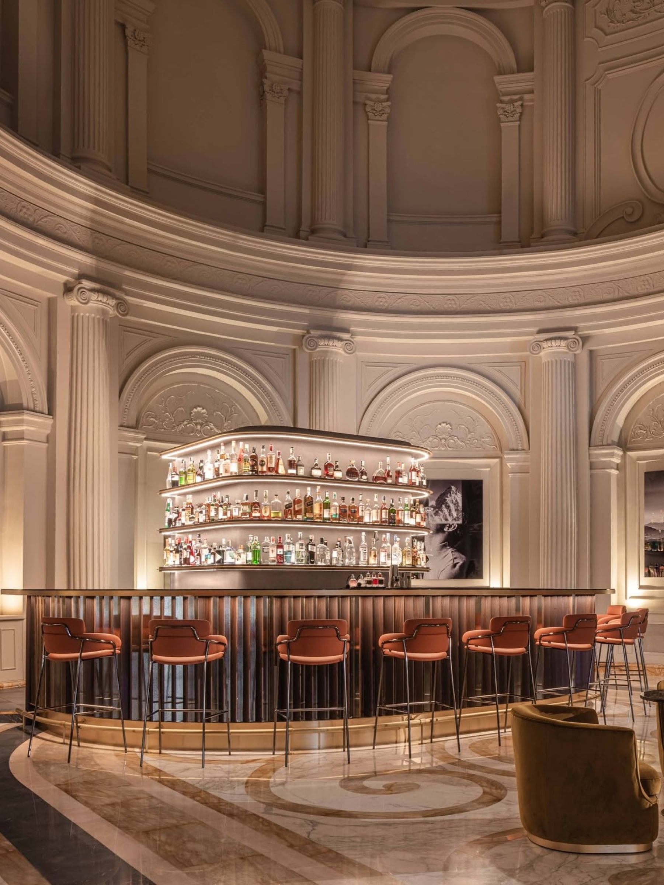
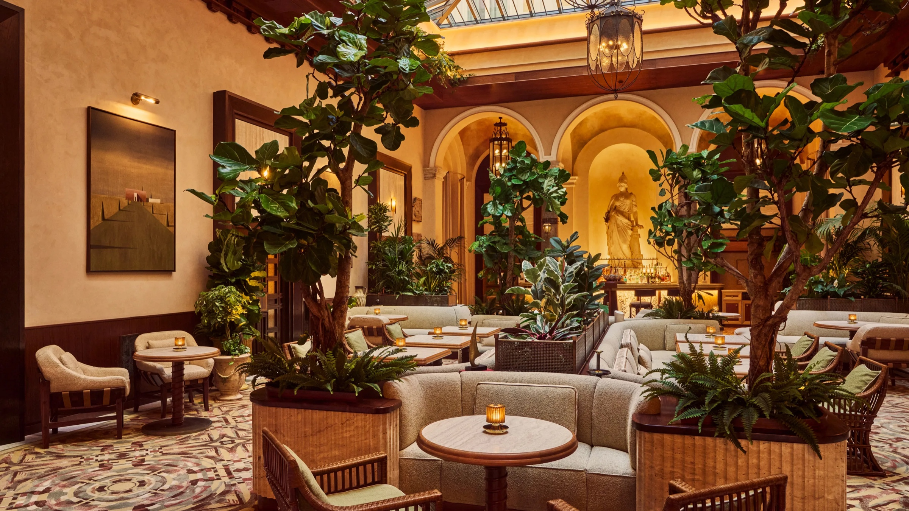
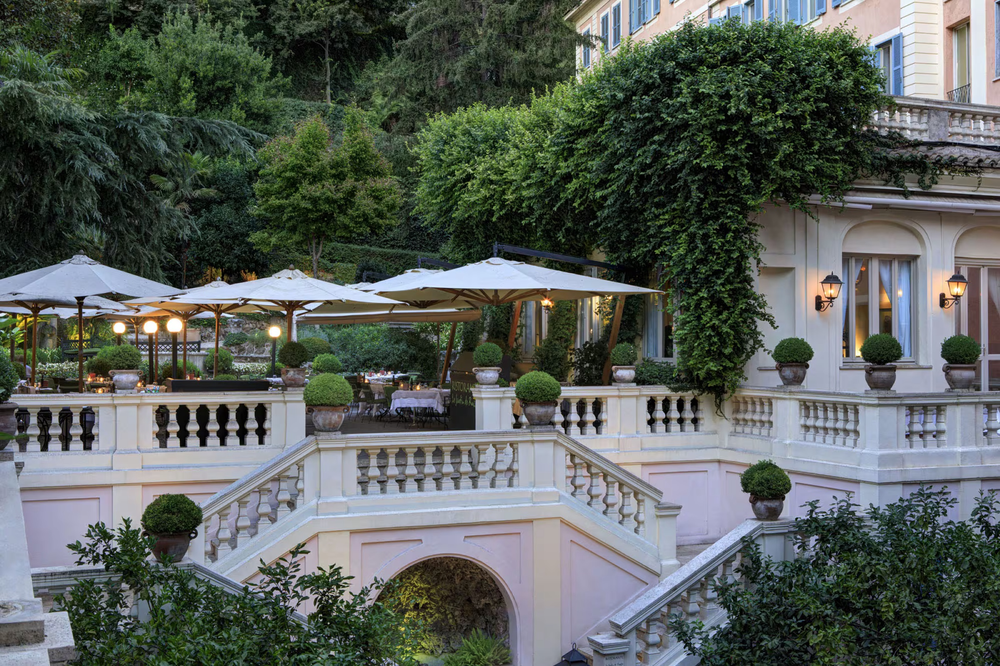

Rome eats late and drinks later. Dinner finishes somewhere near eleven, the piazzas fill with people who have nowhere in particular to be, and the question is always the same: now what?

There is the obvious answer, a plastic cup in Campo de' Fiori, shoulder to shoulder with a stag party from Manchester. And then there is the other Rome, the one behind heavy doors and down unmarked staircases, where the lighting is low on purpose and someone has thought hard about the ice.

These seven rooms are that second kind. They are not secret, and we are not pretending they are. They are simply good, and spread across the centre, so wherever you have eaten, one of them is a walk away.

## Nite Kong

*Photo: @nitekong*

An intimate and sophisticated cocktail bar with a late night atmosphere, offering cocktails and Champagne in a more secluded setting.

It sits on Piazza di San Martino ai Monti, in Monti, which is the part of this list you could most plausibly stumble into rather than plan. The room is very dark: mauve velvet, polished concrete, a wall of backlit bottles doing most of the illuminating.

Sit at the counter if you want to watch the work, or take one of the curved sofas if you have come to talk. There is a Champagne cabinet lit like a vitrine, which tells you what sort of evening is on offer.

**Piazza di San Martino ai Monti 8, 00184 Rome**

## Ocra at Corinthia Rome

*Photo: @corinthiarome*

An elegant cocktail bar inside Corinthia Rome, with warm lighting, signature cocktails, fine spirits and selected vintages.

The ceiling does the talking here, a canopy of gold hexagonal tiles that throws the light back down amber, so everyone in the room looks like the best version of themselves. It is the busiest of the seven, and the most sociable, a bar that hums rather than whispers.

Via Piemonte is a quiet street a few minutes off Via Veneto, which is exactly the right distance from Via Veneto.

**Via Piemonte 62, 00187 Rome**

## Nomos Bar

*Photo: @nomos_bar*

An intimate space in Rome's Rione Regola, featuring natural materials, selected wines and contemporary takes on classic cocktails.

The opposite mood to the two above: pale, quiet, almost monastic. Stone tables, stone stools, a travertine counter, and a wall of stacked blocks that gives the room its texture. One lamp per table and very little else.

Rione Regola is the tangle of lanes between Campo de' Fiori and the river, so this is the one to keep in mind if you have eaten in the centro storico and want to stay there.

**Via di San Paolo alla Regola 3, 00186 Rome**

## Bar della Musa at Palazzo Talìa

*Photo: @palazzo.talia*

A refined cocktail bar inside a historic palazzo, where frescoed interiors meet contemporary mixology, Champagne and selected wines.

A sixteenth century vault, painted and still showing its age, sitting directly above gold tiles and Thonet chairs. The combination should not work and completely does. Of the seven, this is the room that most rewards looking up.

It is off Largo del Nazareno, a minute from the Trevi Fountain and a world away from the crowd around it.

**Largo del Nazareno 25, 00187 Rome**

## Akwa Bar at Anantara Palazzo Naiadi

*Photo: @anantarapalazzonaiadi*

A sophisticated bar in the spectacular lobby of Anantara Palazzo Naiadi, surrounded by neoclassical architecture and Murano glass details.

A curved bar set under a domed rotunda, fluted columns, inlaid marble underfoot. It is the grandest of the seven by some margin, and the easiest to find: Piazza della Repubblica, five minutes from Termini, which makes it a good first or last drink of a trip.

**Piazza della Repubblica 48, 00185 Rome**

## Bar La Minerva

*Photo: @orientexpresslaminerva*

The lobby bar of Orient Express La Minerva, and a winter garden rather than a bar room: fig trees in planters, ferns spilling over the edges, a glazed roof overhead and a mosaic floor underfoot. The statue at the far end is the original Minerva by Rinaldo Rinaldi, which the hotel takes its name from.

It is the softest room on this list, all cream boucle and cane chairs, and the one where a drink most easily turns into two hours. Two minutes from the Pantheon, which means you can walk out of it straight into one of the best squares in Rome at midnight, when it is finally empty.

**Piazza della Minerva 69, 00186 Rome**

## Le Jardin

*Photo: @lejardin_rome*

The only one of the seven that is outdoors, and the reason to keep it for a warm night. This is the Secret Garden of Hotel de Russie, where Le Jardin de Russie serves and the Stravinskij Bar pours: terraces climbing the hillside towards the Pincio in balustraded steps, lit by lamps and candles, ivy covering the wall of the building, clipped box in terracotta pots on every level.

Come for the last hour of light rather than full dark. The garden does something to the noise of the city that has to be experienced rather than described.

**Via del Babuino 9, 00187 Rome**

## Going out, practically

Rome is small. Monti to Piazza della Repubblica is fifteen minutes on foot, and the centro storico is walkable end to end. You can reasonably do two of these in an evening.

Most rooms of this kind take bookings and fill up at weekends, worth a message ahead if you are more than two. And do go late: none of this is at its best at seven.
